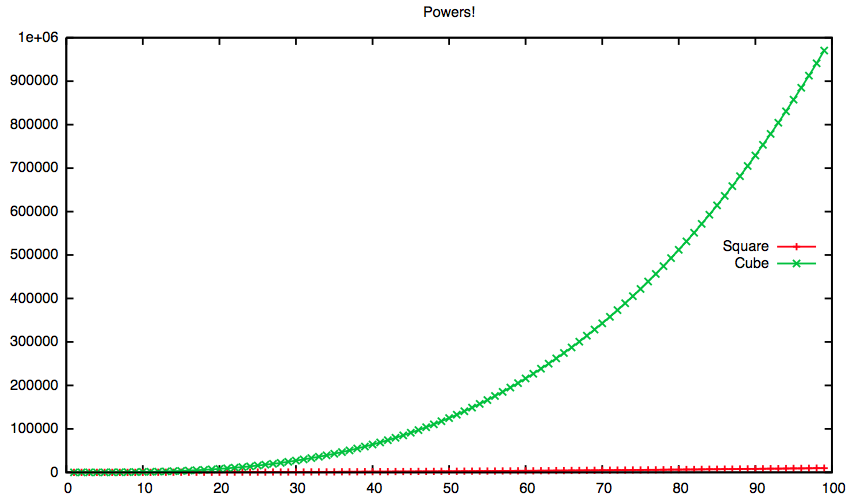
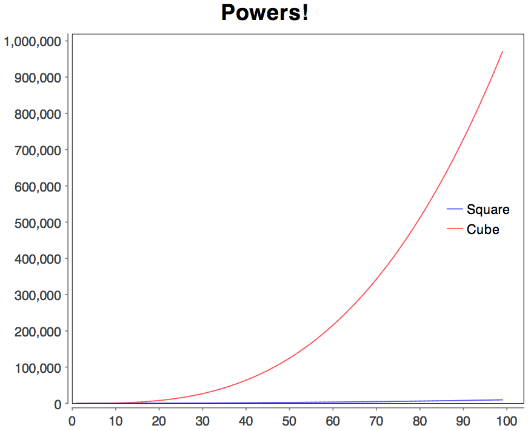

scalaplot
=========

This is a library for quick and easy plotting of simple plots (such as XY line plots, scatter plots) and supports outputs using a few different engines (such as Gnuplot, JFreeGraph, and matplotlib).

## Installation

### Maven dependency

The easiest (and recommended) way to use scalaplot is as a maven dependency. Insert the following in your `pom` file:

    <repositories>
	  ...
      <repository>
        <id>sameer-snapshots</id>
        <name>Sameer repository</name>
        <url>https://github.com/sameersingh/maven-repo/raw/master/snapshots</url>
        <snapshots>
          <enabled>true</enabled>
        </snapshots>
      </repository>
	  ...
    <repositories>
	...
    <dependencies>
      ...
      <dependency>
        <groupId>org.sameersingh.scalaplot</groupId>
        <artifactId>scalaplot</artifactId>
        <version>0.1-SNAPSHOT</version>
      </dependency>
      ...
    </dependencies>

### Install from Source

Download the source and make sure everything is up and running:

    $ mvn install
	
They add the dependency as above into your `pom` file.
	
## Creating Charts

Currently, the library supports line charts.

### XY Line Charts

First step is to get your data into `Seq[Double]`.

    val x = (1 until 100).map(_.toDouble)
    val y = (1 until 100).map(j => math.pow(j, 2))
	
Create a dataset that represents these sequences.

    val series = new MemXYSeries(x, y, "Square")
    val data = new XYData(series)

You can add more series too.

    data += new MemXYSeries(x, x.map(i => i*i*i), "Cube")

Let's create the chart.

    val chart = new XYChart("Powers!", data)
    chart.showLegend = true

## Rendering Charts

### Gnuplot

Generates gnuplot scripts that will need to be run to actually generate the images.

    val plotter = new GnuplotPlotter(chart)
	plotter.writeToPdf("dir/", "name")
	
followed by

    $ cd dir/
	$ gnuplot name.gpl
	$ open name.pdf
	
produces

### JFreegraph

JFreegraph can also be called similarly to produce pdf plots (use `JFGraphPlotter`).
However, it also supports a `gui()` option for when you just want to see the graph.

    val plotter = new JFGraphPlotter(chart)
	plotter.gui()

produces

### Matplotlib

Currently not supported.

## Customizations

List of various customizations to charts, and how well they are supported.

_Coming soon!_
